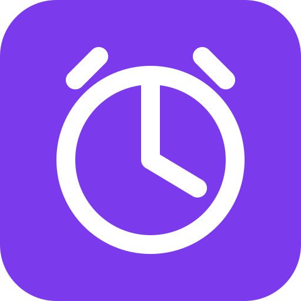

<div align="center">



# ErinnerMich

**Erinnerungen, Habits und Mood – privat, lokal, ohne Account.**

[](https://github.com/daniel-rck/ErinnerMich/actions/workflows/ci.yml)
[](./LICENSE)
[](https://www.typescriptlang.org/)
[](https://react.dev/)
[](https://vitejs.dev/)
[](https://tailwindcss.com/)
[](https://web.dev/progressive-web-apps/)
[](https://bun.sh/)
[](https://erinnermich.daniel-rck.workers.dev/)

</div>

---

## Was ist ErinnerMich?

Eine Progressive Web App, die wiederkehrende Erinnerungen, Habits und Stimmungs­tracking in einem schlanken, schnellen Interface bündelt. Sie läuft komplett im Browser – ohne Account, ohne Tracking, ohne Cloud-Zwang.

### Features

- 🔔 **Wiederkehrende Erinnerungen** mit flexibler Schedule-Engine (täglich, wöchentlich, monatlich, frei definierbar)
- ✅ **Habit-Tracking** mit Streaks und Jahres-Heatmap
- 🧠 **Mood-Logging** und Stats über die Zeit
- 📲 **Installierbar als PWA** – auf Desktop und Mobile, funktioniert offline
- 🔒 **Komplett lokal**: kein Account, keine Cookies, kein Tracking, DSGVO-konform

### Screenshots

<!-- Screenshots werden ergänzt, sobald die UI-Releases stabil sind -->

> Screenshots folgen mit dem nächsten stabilen Release.

### Jetzt nutzen

👉 **[erinnermich.daniel-rck.workers.dev](https://erinnermich.daniel-rck.workers.dev/)**

Einfach im Browser öffnen. Über das Browser-Menü („Zum Startbildschirm hinzufügen" / „App installieren") wird ErinnerMich zur installierten App – inklusive Offline-Support und Benachrichtigungen.

### Datenschutz

- Keine Cookies, keine Analytics, keine Third-Party-Calls
- Alle Reminder-, Habit- und Event-Daten liegen ausschließlich lokal im Browser (IndexedDB / `localStorage`)
- Optionaler Sync (geplant) überträgt nur AES-GCM-verschlüsselte Bytes – der Server sieht keinen Klartext

---

## Für Entwickler

### Tech-Stack

| Bereich | Wahl |
|---|---|
| Framework | React 19 + TypeScript (strict) |
| Build | Vite 7 |
| Styling | Tailwind CSS 4 |
| PWA | `vite-plugin-pwa` (`injectManifest`, eigener Service Worker) |
| Tests | Vitest + Testing Library |
| Storage | IndexedDB (`idb`) + `localStorage` für Settings |
| Hosting | Cloudflare Workers + Static Assets |
| Package Manager | Bun |

### Lokal starten

```bash
bun install
bun run dev          # Vite Dev Server auf http://localhost:5173
bun run build        # Production Build nach dist/
bun run preview      # gebauten Stand lokal ausliefern
bun run test         # Vitest einmalig
bun run test:watch   # Vitest watch mode
bun run lint         # ESLint
bun run typecheck    # tsc -b --noEmit
```

### Cloudflare Worker

```bash
bun run build           # erst dist/ erzeugen
bun run worker:dev      # wrangler dev — lokaler Worker mit Static Assets
bun run worker:deploy   # Deployment
```

### Projektstruktur

```
src/
├── App.tsx              # App-Shell
├── main.tsx             # Entry Point
├── index.css            # Tailwind 4 Entry
├── components/          # UI-Komponenten (AppShell, Forms, Toast, …)
├── pages/               # Routen (Today, Habits, Mood, Stats, …)
├── lib/
│   ├── db/              # IndexedDB-Layer (idb)
│   ├── schedule/        # Schedule-Engine (Recurring-Logik)
│   ├── notifications/   # Notifications API + Fallback
│   ├── stats/           # Stats-Aggregation
│   ├── design/          # Design-Tokens & Primitives
│   └── …
└── sw/index.ts          # Service Worker (Workbox precache)

worker/
└── index.ts             # Cloudflare Worker (SPA-Routing + /healthz)
```

### Mitmachen

PRs und Issues sind willkommen. Setup, Branch-Strategie und PR-Checkliste stehen in [CONTRIBUTING.md](./CONTRIBUTING.md).

### Sicherheit

Sicherheits­lücken bitte **nicht** über öffentliche Issues melden – stattdessen über [GitHub Security Advisories](https://github.com/daniel-rck/ErinnerMich/security/advisories/new). Details in [SECURITY.md](./SECURITY.md).

### Roadmap

Die geplanten Phasen und das Datenmodell sind in [PLAN.md](./PLAN.md) dokumentiert.

### Lizenz

[MIT](./LICENSE) © Daniel Rück
